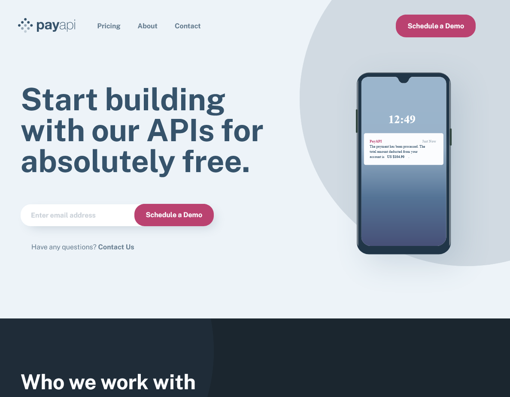

# Frontend Mentor - PayAPI multi-page website solution

This is a solution to the [PayAPI multi-page website challenge on Frontend Mentor](https://www.frontendmentor.io/challenges/payapi-multipage-website-FDLR1Y11e). Frontend Mentor challenges help you improve your coding skills by building realistic projects.

## Table of contents

- [Overview](#overview)
  - [The challenge](#the-challenge)
  - [Screenshot](#screenshot)
  - [Links](#links)
- [My process](#my-process)
  - [Built with](#built-with)
  - [What I learned](#what-i-learned)
  - [Continued development](#continued-development)
- [Author](#author)

## Overview

### The challenge

Users should be able to:

- View the optimal layout for each page depending on their device's screen size
- See hover states for all interactive elements throughout the site
- Receive an error message when the contact form is submitted if:
  - The `Name`, `Email Address` or `Message` fields are empty should show "This field can't be empty"
  - The `Email Address` is not formatted correctly should show "Please use a valid email address"

### Screenshot



### Links

- Solution URL: [https://github.com/Joelynn94/payapi-website](https://github.com/Joelynn94/payapi-website)
- Live Site URL: [https://jl-pay-api.netlify.app/](https://jl-pay-api.netlify.app/)

## My process

### Built with

- Semantic HTML5 markup
- CSS custom properties
- CSS partials
- Flexbox
- CSS Grid
- JavaScript
- Mobile-first workflow

### What I learned

I am happy about the clean JavaScript utility functions I wrote to use for form validation. It made form validation much more DRY and easier to implement.

```js
// Check if the input is empty
function isEmpty(value) {
  return value === "" ? true : false;
}

// Check if the length is between the min and max values
function isBetween(length, min, max) {
  return length < min || length > max ? false : true;
}

// Check if an email is a valid pattern
function isValidEmail(email) {
  const pattern =
    /^[a-zA-Z0-9.!#$%&'*+/=?^_`{|}~-]+@[a-zA-Z0-9-]+(?:.[a-zA-Z0-9-]+)*$/;
  return pattern.test(email);
}
```

```js
// Check email input is not empty and matches email pattern
function checkEmail() {
  // Start isValid as false
  let isValid = false;
  // Trim the email input value
  const email = emailInput.value.trim();

  // Check if the email input is empty
  if (isEmpty(email)) {
    showError(emailInput, "Email cannot be blank");
    // Check if the email input is a valid pattern
  } else if (!isValidEmail(email)) {
    showError(emailInput, "Email is not valid");
    // Otherwise, clear the error and set isValid to true
  } else {
    clearError(emailInput);
    isValid = true;
  }
  return isValid;
}
```

### Continued development

I was struggling with positioning the background circles with css. I decided to create extra media queries to control the circle size. However, I think working with the `calc()` css function might have been beneficial.

## Author

- Website - [Joseph Lynn](https://www.josephlynn.com/)
- Frontend Mentor - [@Joelynn94](https://www.frontendmentor.io/profile/Joelynn94)
- Twitter - [@joe1ynn](https://twitter.com/joe1ynn)
